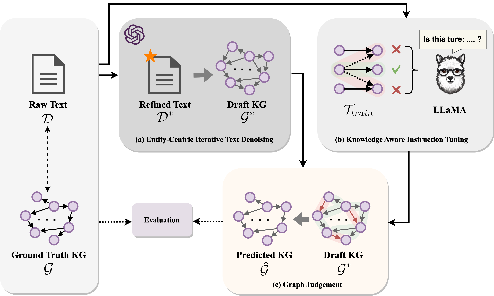

# <center>  Can LLMs be Good Graph Judger for Knowledge Graph Construction?</center>

This is the repo for the paper [Can LLMs be Good Graph Judger for Knowledge Graph Construction?](https://arxiv.org/abs/2411.17388).

LoRA weights have been released: 🤗 <a href="https://huggingface.co/HaoyuHuang2/graphjudger" target="_blank">Hugging Face</a>.
<a href="https://github.com/hhy-huang/GraphJudger" target="_blank">
    
</a>




## Project Structure
```
.
├── README.md
├── .gitignore
├── LICENSE
├── chat
│   ├── run_chatgpt_entity.py
│   ├── run_chatgpt_triple.py
│   └── run_chatgpt.py
├── datasets
│   ├── GPT3.5_result_GenWiki-Hard
│   ├── GPT3.5_result_rebel_sub
│   ├── GPT3.5_result_SCIERC
│   └── process_data.ipynb
├── graph_evaluation
│   ├── metrics
│   │   ├── eval.py
│   │   └── graph_matching.py
│   └── eval.sh
├── graphjudger
│   ├── data
│   │   ├── genwiki
│   │   ├── rebel_sub
│   │   └── scierc
│   ├── models
│   │   ├── genwiki
│   │   ├── rebel_sub
│   │   └── scierc
│   ├── lora_finetune_genwiki.py
│   ├── lora_finetune_rebel.py
│   ├── lora_finetune_scierc.py
│   ├── lora_infer_genwiki.py
│   ├── lora_infer_rebel.py
│   └── lora_infer_scierc.py
└── img
    ├── graphjudger.png
    ├── graphjudger2.png
    └── icon.png
```

## Guidance 

Coming soon.

## Cite Us
```
@misc{huang2024llmsgoodgraphjudger,
      title={Can LLMs be Good Graph Judger for Knowledge Graph Construction?}, 
      author={Haoyu Huang and Chong Chen and Conghui He and Yang Li and Jiawei Jiang and Wentao Zhang},
      year={2024},
      eprint={2411.17388},
      archivePrefix={arXiv},
      primaryClass={cs.CL},
      url={https://arxiv.org/abs/2411.17388}, 
}
```
